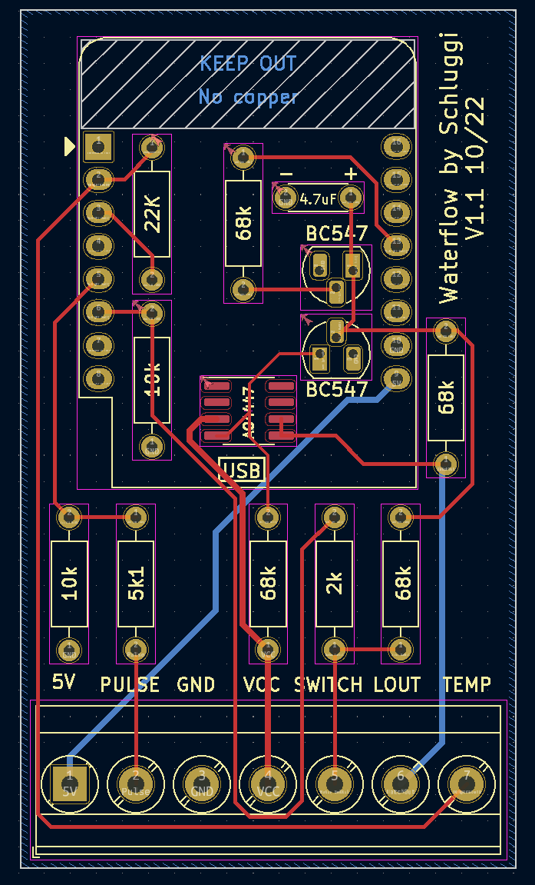

# waterflow-pcb

> __WARNING!__ The PCB is not tested yet. I'll remove this info after my order arrived and got tested.
> 
> **Update**: after testing v1.0: It does work but only with a lot of modifications. So lets test v1.1...

## Description
I love the idea of GreatScott`s [Online Water Tracker](https://www.youtube.com/watch?v=BNK92ep8DhY), but unfortunately
it was really difficult for me to implement his circuit on a perfboard, so I designed a cheap PCB for this.

> Please notice, that this board does not replace/included the charge circuit (TP4056) or the boost converter. It
> only replaces the big ESP circuit.

The PCB has also some improvements:
- Resistor for the status LED is placed on the PCB
- Connection terminals to easily (dis)connect everything
- Extra connection for waterflow-sensors with temperature sensor

## Images

## How to order?
Before you order the PCB, make sure you had all components need. You can find them
[here](https://www.instructables.com/Online-Water-Tracker-Reduce-Shower-Time/). Also don't forget to 3d print the case.

Ready? Lets go. I always order my PCBs via [JLCPCB](https://jlcpcb.com) a chines PCB manufacture.
1. Create an account
2. Click "Order now"
3. Upload the zip file located inside the [manufactoring](manufactoring) directory
4. Optional: Choose a different color, an ECO-friendly lead-free surface finish and check that no order number is 
printed on the PCB (for aesthetic reasons).

After all you got 5 PCBs for less than 10€. 

## Questions
Just open an issue :)

## Credits 
Created and maintained by Lukas Schulte-Tickmann / Schluggi.

Inspired by [GreatScott](https://www.instructables.com/member/GreatScottLab/). 